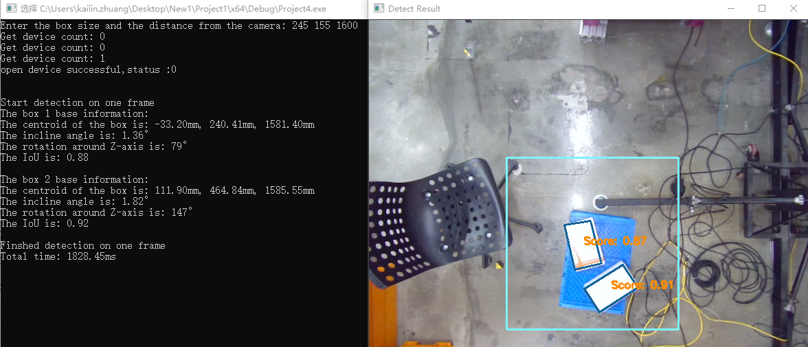
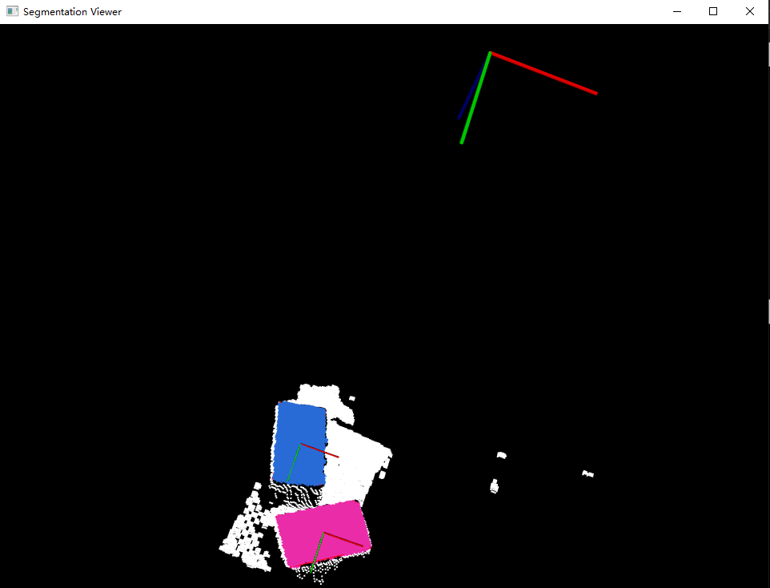

# Traditional Object Detection

All the codes are programed with C++ with using a RGB-D Vzense camera doing the object detection.

## Table of Contents

- [Overview](#overview)
- [Installation](#installation)
- [Features](#features)
- [Contributing](#contributing)

## Overview

All the codes are programed with C++ with using a RGB-D Vzense camera doing the object detection.
We make full use of the SDK provided by the manufacture and some Python library to reduce the job in object detection.

The following will show the general flow of the entire target detection algorithm scripts.

    

## Installation

This code uses an RGB-D camera from `Vzense Technologies`, so if you want to run this code successfully, you're going to have to go to the manufacturer's official website to download the supplied camera drivers and dependent packages. The rest of the common `Python` packages such as `matplotlib`, `opencv` have no special version requirements.

## Features

The application scenarios of this project are target detection scenarios in  `traditional industrial development`, such as robotic arm gripping, large-scale palletiser handling goods and other real-time application scenarios. 

The following is the final `detection effect` of this object detection script:

    

    

## Contributing

All documents for this project were completed by my own.

## Additional Information

Feel free to customize this framework to fit the specific needs and characteristics of your project.
